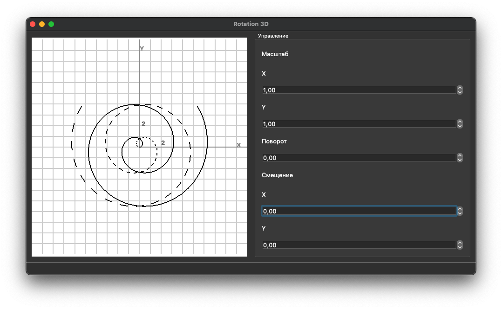
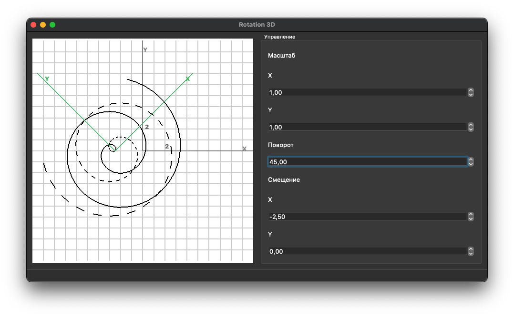

# OpenGL 2D rotation

Educational project for transforming 2D objects using matrices.

## Installation

1. Install [QT](https://www.qt.io/download). During development, version QT `5.15.2` was used;
2. `git clone https://github.com/AKosmachyov/opengl-2d-rotation`;
3. Open the project from QT;
